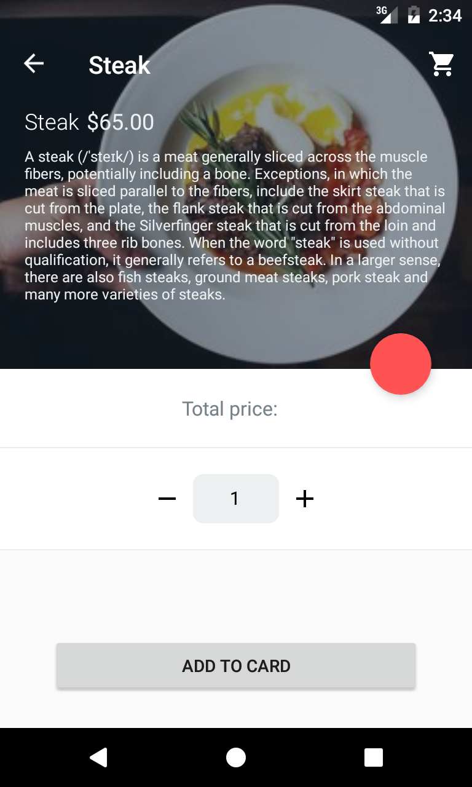

# Restaurant App 
if you have any questions, don't hesitate to ask [me on twitter](https://twitter.com/jurabek0).

Restaurant App is containerized polyglot microservices application that contains projects based on .NET Core, Golang, Java, Xamarin, React, Angular and etc. The project demonstrates how to develop small microservices for larger applications using containers, orchestration, service discovery, gateway, and best practices. You are always welcome to improve code quality and contribute it, if you have any questions or issues don't hesitate to ask in our [gitter](https://gitter.im/Restaurant-App-Community/community?utm_source=badge&utm_medium=badge&utm_campaign=pr-badge) chat.

To getting started, simply fork this repository. Please refer to [CONTRIBUTING.md](CONTRIBUTING.md) for contribution guidelines.

## Motivation

- Developing independently deployable and scalable micro-services based on best practies using containerization ☸ 🐳 
- Developing cross-platform beautiful mobile apps using Xamarin.Forms
- Developing Single Page applications using React and Angular including best practices
- Configuring fully automated CI/CD pipelines using Github Actions to mono-repo and Azure Pipelines and AppCenter for mobile
- Using modern technologies such as GraphQL, gRPC, Apache Kafka, Serverless, Istio
- Writing clean, maintainable and fully testable code, Unit Testing, Integration Testing and Mocking practices
- Using SOLID Design Principles
- Using Design Patterns and Best practices in different programming languages

## Architecture overview

The architecture proposes a micro-service oriented architecture implementation with multiple autonomous micro-services (each one owning its own data/db and programming language) and using REST/HTTP as the communication protocol between the client apps, and gRPC for the backend communication in order to support data update propagation across multiple services.

## List of micro-services and infrastructure components

<table>
   <thead>
    <th>№</th>
    <th>Service</th>
    <th>Description</th>
    <th>Build status</th>
    <th>Quality</th>
    <th>Endpoints</th>
  </thead>
  <tbody>
    <tr>
        <td align="center">1.</td>
        <td>Identity API (.NET Core + IdentityServer4)</td>
        <td>Identity management service, powered by OAuth2 and OpenID Connect</td>
        <td>
            
        </td>
        <td>
            
        </td>
        <td>
            <a href="#">dev</a> | <a href="#">prod</a>
        </td>
    </tr>
    <tr>
        <td align="center">2.</td>
        <td>Basket API (Golang + Redis)</td>
        <td>Manages customer basket in order to keep items on in-memory cache using redis</td>
        <td>
            
        </td>
        <td>
            
        </td>
        <td>
            <a href="#">dev</a> |
            <a href="#">prod</a>
        </td>
    </tr>
    <tr>
        <td align="center">3.</td>
        <td>Menu API (.NET Core, PostgreSQL)</td>
        <td>Manages data for showing restaurant menu</td>
        <td>
            
        </td>
        <td>
            
        </td>
        <td>
            <a href="#">dev</a> |
            <a href="#">prod</a>
        </td>
    </tr>
    <tr>
        <td align="center">4.</td>
        <td>Order API (Java + Spring Boot)</td>
        <td>Manages customer orders</td>
        <td>
            
        </td>
        <td>
            
        </td>
        <td>
            <a href="#">dev</a> |
            <a href="#">prod</a>
        </td>
    </tr>
  </tbody>  
</table>

## Mobile app
[Unfortunately I no longer be able to maintain Xamarin(mobile) part](https://github.com/chayxana/Restaurant-App/issues/81)

| Mobile              | Build status | Release |
|---------------------|--------------|-------------------|
| Android             || [Download Android]("/") |
| iOS                 || [Download iOS]("/") |

Mobile app developed by Xamarin.Forms and supports iOS and Android, here you can find how to develop cross-platform mobile apps using C#.
The example shows how to develop beautiful user interfaces using Xamarin.Forms and how to manage your code with Clean Architecture on the mobile side and get a clean, maintainable, testable code.

 

### Contributors

Thank you to all the people who have already contributed to our project!

