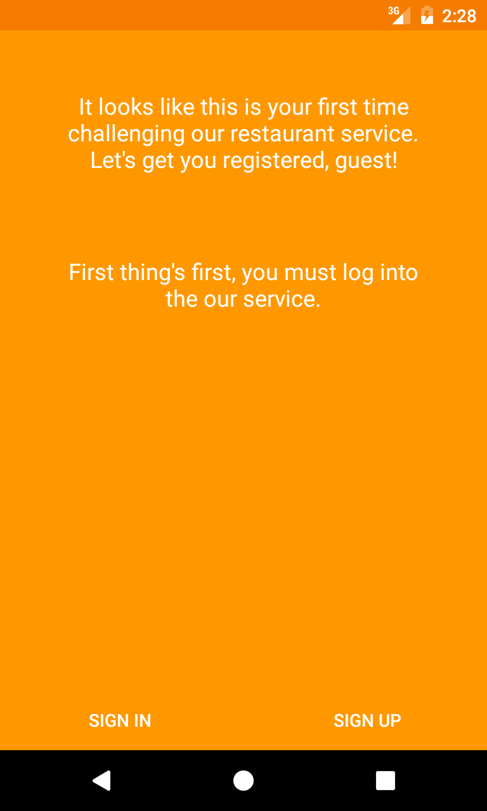

# Restaurant App
  

The Restaurant App is open source application written by C# and Xamarin.Forms and it uses SOLID Principles, Clean code, Clean Architecture, Testable Code, Beautiful UX design and fully MVVM implementation.

## Using technologies

* ASP.Net Core Web API + Identity Server4
* Entity Framework Core + PostgreSql + SqlServer
* Xamarin.Forms + Material Design
* Custom Renderers
* Reactive UI
* Dependency Injection
* BDD Unit testing
* Moq
* PowerShell
* [Angualar 4 - Dashboard Admin](https://github.com/Jurabek/Restaurant-Manager/tree/develop/Dashboard-Admin)
* WPF - coming soon
* Docker Containers - coming Soon

**Development:**

* [Jurabek Azizkhujaev](https://github.com/jurabek)

**Feature implementation:**

* Ordering foods using AI with neural network
* Creating chatbot for this neural network
