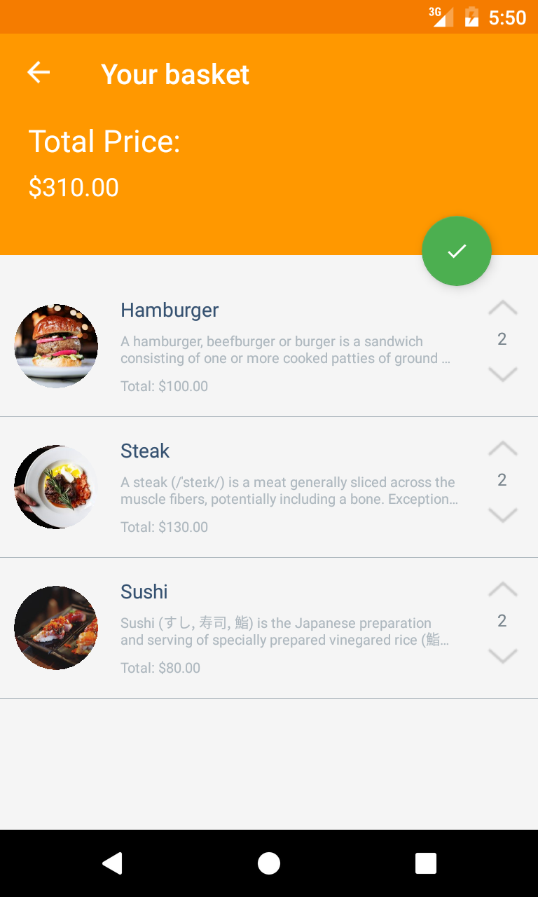
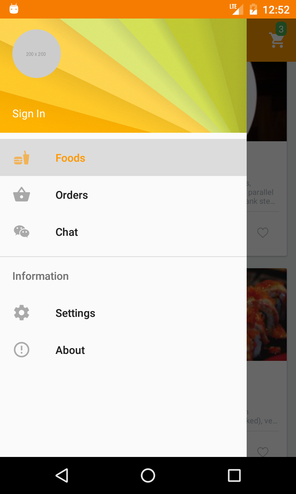

# Restaurant App

| Microservices | Language      | Build Status|
| ------------- |:-------------:| -----:|
| Basket API    | Golang        |  |
| Menu API      | .net core     |    |
| Identity API | .net core      |     |
| Order API | java |     |
|iOS App | C#/Xamarin      |  |
| Android App| C#/Xamarin      |  |

    

The Restaurant App is a sample open source application powered by C# and Xamarin, this sample provides us how to build mobile and web applications with a clean architecture and write testable and clean code.

## Using technologies

* Back-end
  * ASP.NET Core Web API
  * Identity Server4
  * Entity Framework Core
  * PostgreSQL
  * SQL Server
* Xamarin
  * Xamarin.Forms + Material Design
  * Custom Renderers
  * Reactive UI
  * Rx.NET
  * MVVM
  * Dependency Injection (Autofac)
* Testing
  * BDD Unit testing
  * Moq
  * xUnit (backend)
  * NUnit (xamarin)
  * AutoFixture
* DevOps
  * PowerShell
  * CI (AppVeyor)
  * [Azure Deploy](https://restaurantserverapi.azurewebsites.net/)
  * Heroku Deploy - cooming soon
  * Docker Containers - cooming soon
* Front-end
  * [Angualar 4 - Dashboard Admin](https://github.com/Jurabek/Restaurant-App-Dashboard)

**Development:**

* [Jurabek Azizkhujaev](https://github.com/jurabek)

**Future implementations:**

* Ordering foods using AI with neural network
* Creating chatbot for this neural network
